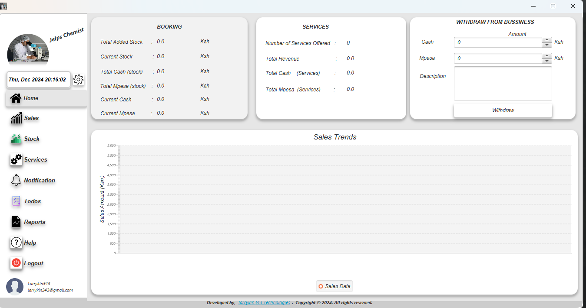
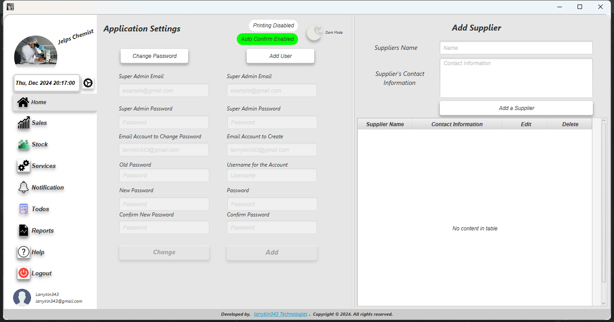

# JelpsChemistPos

## Description
JelpsChemistPos is desktop a Point of Sale (POS) system designed for chemists. It helps manage inventory, sales, and customer interactions efficiently.

## Features
- Inventory management
- Sales tracking
- Customer management
- Reporting
- User authentication

## Installation
To install and run the project locally, follow these steps:

1. Clone the repository:
    ```sh
    git clone https://github.com/kinuthia-lawrence/JepsChemistPos.git
    ```
2. Navigate to the project directory:
    ```sh
    cd JepsChemistPos
    ```
3. Build the project using Maven:
    ```sh
    mvn clean install
    ```
4. Run the application:
    ```sh
    java -jar target/JepsChemistPos-1.0-SNAPSHOT.jar
    ```

## Usage
1. Launch the application.
2. Log in with your credentials.
3. Navigate through the menu to manage inventory, process sales, and generate reports.

## Screenshots

*Login Screen*


*Dashboard*


*Settings Screen*

## Technologies Used
- Java
- JavaFX
- SQL
- Maven

## Contributing
Contributions are welcome! Please follow these steps to contribute:

1. Fork the repository.
2. Create a new branch:
    ```sh
    git checkout -b feature/YourFeature
    ```
3. Commit your changes:
    ```sh
    git commit -m 'Add some feature'
    ```
4. Push to the branch:
    ```sh
    git push origin feature/YourFeature
    ```
5. Open a pull request.

## License
This project is licensed under the MIT License - see the [LICENSE](LICENSE) file for details.

## Contact
For any inquiries or collaborations, please contact:
- **Lawrence Kinuthia**
- Phone: +254748590146
- Email: kinuthialawrence343@gmail.com
- Website: [larrykin343.vercel.app](https://larrykin343.vercel.app/)
